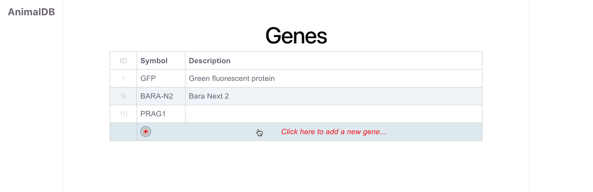
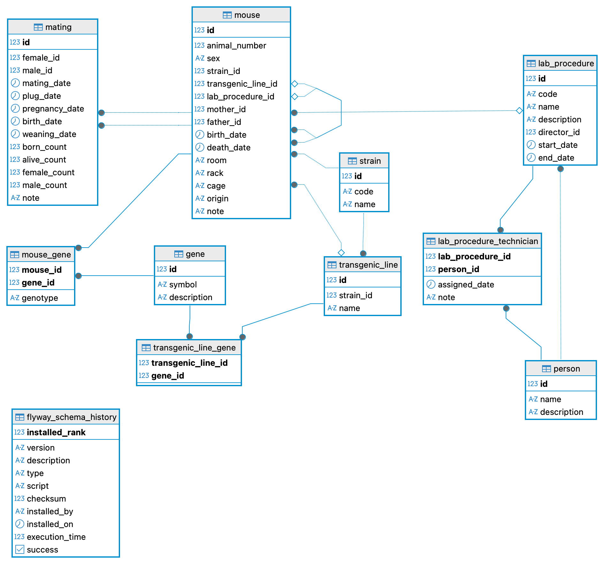

# AnimalDB

AnimalDB is a laboratory animal management system for tracking mice, breeding, genealogy, transgenic lines, genes, and experimental data.

This project is a Spring Boot backend application that uses PostgreSQL for data storage. It provides a REST API for managing laboratory animal data, which will be consumed by a React frontend.

The application is designed for a real animal facility use case and focuses on clean relational data modelling, traceability, and future extensibility.

## Project purpose

The goal of AnimalDB is to support the daily work of a laboratory animal facility by providing a structured system for managing information about laboratory mice, their genetic background, breeding history, genealogy, and procedures performed by laboratory staff.

## Main features

- Management of laboratory mouse records
- Tracking of strains and transgenic lines
- Parent-child genealogy tracking through mother and father references
- Breeding and mating records
- Gene and genotype tracking
- Laboratory procedure management
- Assignment of technicians and directors to procedures
- PostgreSQL schema versioning with Flyway
- REST API backend for future React frontend integration

## Current frontend prototype

AnimalDB includes an initial React frontend prototype for managing gene records.

The current Gene view provides a simple table-based interface for displaying, adding, <!--   editing, --> and deleting gene definitions stored in the backend PostgreSQL database through the REST API.



### Gene view functionality

The Gene view currently supports:

- displaying all gene records from the backend,
- adding a new gene through a popup form,
- editing an existing gene by clicking a table row,
<!-- - deleting an existing gene from the edit popup, -->
- refreshing the list after create, update, or delete operations.

The frontend communicates with the backend using the following REST endpoints:

```text
GET    /api/genes       List all genes
POST   /api/genes       Create a new gene
<!-- PUT    /api/genes/{id}  Update an existing gene -->
DELETE /api/genes/{id}  Delete an existing gene
```

The interface is intentionally simple at this stage. It is used as the first working frontend slice for validating the full application flow:

React UI -> REST Controller -> Service -> Repository -> PostgreSQL

This first frontend screen will be used as a pattern for implementing additional AnimalDB views, such as mice, strains, transgenic lines, mating records, and laboratory procedures.

## Technology stack

- Java 21
- Spring Boot
- Spring Data JPA / Hibernate
- PostgreSQL
- Flyway
- Testcontainers
- JUnit 5
- React
- Maven
- Docker / Docker Compose

## Database schema

The database schema is versioned using Flyway migrations located in:

```text
src/main/resources/db/migration/
```

Current public database model:



### Main database tables

| Table | Purpose |
|---|---|
| `mouse` | Stores individual laboratory mouse records, including animal number, sex, strain, transgenic line, genealogy, location, dates, and notes. |
| `strain` | Stores mouse strain definitions, such as strain code and name. |
| `transgenic_line` | Stores transgenic lines linked to mouse strains. |
| `gene` | Stores gene definitions and descriptions. |
| `mouse_gene` | Links individual mice with genes and stores genotype information. |
| `transgenic_line_gene` | Links transgenic lines with genes. |
| `mating` | Stores breeding pairs, mating dates, plug/pregnancy/birth/weaning dates, and litter statistics. |
| `lab_procedure` | Stores laboratory procedures, including code, name, description, director, start date, and end date. |
| `lab_procedure_technician` | Links procedures with technicians and stores assignment details. |
| `person` | Stores people involved in laboratory procedures. |

> `flyway_schema_history` is a technical Flyway table used to track executed database migrations.

## Example domain model

AnimalDB models laboratory mice as the central entity. Each mouse can be linked to:

- a strain,
- a transgenic line,
- mother and father records for genealogy tracking,
- genes and genotype data,
- laboratory procedures,
- mating records as male or female parent.

This structure allows the system to represent both biological relationships and operational laboratory workflows.

## Getting started

Before running the application for the first time, create the PostgreSQL database and application user as described in the **Local Database Setup** guide:

[dev.database/README.md](dev.database/README.md)

Then start the application:

```bash
./mvnw spring-boot:run
```

Flyway migrations are executed automatically during application startup.

## Running the application

### Prerequisites

- Java 21
- Maven
- PostgreSQL or Docker
- Docker Desktop, if running integration tests with Testcontainers

### Run PostgreSQL with Docker Compose

```bash
docker compose up -d
```

### Run the backend

```bash
./mvnw spring-boot:run
```

## Tests

Run all tests with:

```bash
./mvnw test
```

### JPA entity tests

JPA entity tests use `testcontainers-junit-jupiter`, so a local Docker Desktop installation is required.

These tests start a PostgreSQL container and verify persistence mappings against a real PostgreSQL database instead of an in-memory database.

## Project status

This project is currently under active development. The backend data model and database schema are being designed and implemented first. An initial React frontend prototype has been added for the Gene entity and will be extended to other parts of the domain model.

## Repository structure

```text
src/main/java/                 Java source code
src/main/resources/            Application configuration and Flyway migrations
src/main/resources/db/migration/ Flyway database migrations
src/test/java/                 Unit and integration tests
dev.database/                 Local PostgreSQL setup documentation
docs/                          Project documentation and database diagrams
```

## Author

Tomasz Pierzchała

GitHub: [TomaszPierzchala](https://github.com/TomaszPierzchala)
