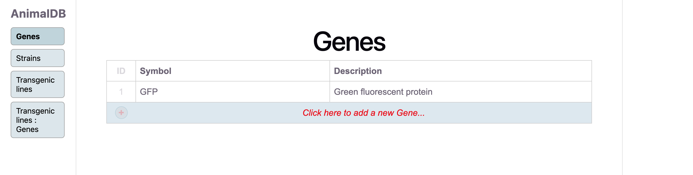
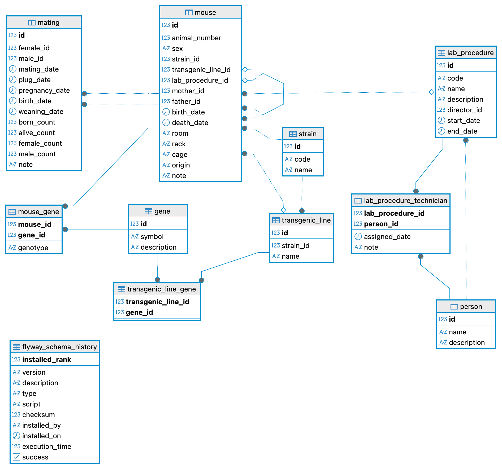

# AnimalDB

AnimalDB is a laboratory animal management system for tracking mice, breeding, genealogy, transgenic lines, genes, and experimental data.

The application consists of a Spring Boot backend, a PostgreSQL database, and a React frontend.

It is designed for a real laboratory animal facility use case, with an emphasis on clean relational data modelling, traceability, maintainability, and future extensibility.

**Live demo:** [AnimalDB on Render](https://animaldb-frontend.onrender.com/)

> The application uses Render's free service tier. After a period of inactivity, services may be put to sleep. The first load can take approximately two minutes.

## Project purpose

The goal of AnimalDB is to support the daily work of a laboratory animal facility by providing a structured system for managing information about laboratory mice, their genetic background, breeding history, genealogy, and procedures performed by laboratory staff.

The project aims to replace spreadsheet-based record keeping with a relational database and a user-friendly web interface.

## Main features

- Management of laboratory mouse records
- Tracking of strains and transgenic lines
- Parent-child genealogy tracking through mother and father references
- Breeding and mating records
- Gene and genotype tracking
- Laboratory procedure management
- Assignment of technicians and directors to procedures
- PostgreSQL schema versioning with Flyway
- REST API integration with the React frontend

## Frontend

AnimalDB includes a React frontend for managing laboratory animal data.

The interface uses table-based views and popup forms to provide straightforward access to records stored in PostgreSQL through the backend REST API.

### Gene view — Reference implementation

The Gene view is an example of a fully functional CRUD interface in AnimalDB. It demonstrates the integration between the React frontend, Spring Boot REST API, and PostgreSQL database.



The view supports:

- Displaying gene records retrieved from the backend
- Adding a new gene through a popup form
- Editing an existing gene by clicking a table row
- Deleting an existing gene from the edit popup
- Refreshing the list after create, update, or delete operations

The frontend communicates with the backend using the following REST endpoints:

```text
GET    /api/genes       List all genes
POST   /api/genes       Create a new gene
PUT    /api/genes/{id}  Update an existing gene
DELETE /api/genes/{id}  Delete an existing gene
```

The application follows a layered architecture:

```text
React UI
    |
    | JSON
    v
REST Controller
    |
    | DTO
    v
Service
    |
    | Entity
    v
Repository
    |
    v
PostgreSQL
```

The frontend is built using React and Vite.

Vite provides a development server with hot module replacement (HMR) and produces optimized frontend assets for production deployment.

The Gene view serves as a reference implementation for developing additional views for mice, strains, transgenic lines, mating records, and laboratory procedures.

## Technology stack

### Backend

- Java 21 / Kotlin
- Spring Boot
- Spring Data JPA / Hibernate
- PostgreSQL
- Flyway
- Maven

### Frontend

- React
- JavaScript
- Vite
- Node.js / npm

### Testing

- JUnit 5
- Mockito
- Testcontainers

### Infrastructure

- Docker
- Render (cloud deployment)

## Database schema

The database schema is versioned using Flyway migrations located in:

```text
src/main/resources/db/migration/
```

Current public database model:



### Main database tables

| Table | Purpose |
|---|---|
| `mouse` | Stores individual laboratory mouse records, including animal number, sex, strain, transgenic line, genealogy, location, dates, and notes. |
| `strain` | Stores mouse strain definitions, such as strain code and name. |
| `transgenic_line` | Stores transgenic lines linked to mouse strains. |
| `gene` | Stores gene definitions and descriptions. |
| `mouse_gene` | Links individual mice with genes and stores genotype information. |
| `transgenic_line_gene` | Links transgenic lines with genes. |
| `mating` | Stores breeding pairs, mating dates, plug/pregnancy/birth/weaning dates, and litter statistics. |
| `lab_procedure` | Stores laboratory procedures, including code, name, description, director, start date, and end date. |
| `lab_procedure_technician` | Links procedures with technicians and stores assignment details. |
| `person` | Stores people involved in laboratory procedures. |

> `flyway_schema_history` is a technical Flyway table used to track executed database migrations.

## Example domain model

AnimalDB models laboratory mice as the central entity.

Each mouse can be linked to:

- A strain
- A transgenic line
- Mother and father records for genealogy tracking
- Genes and genotype data
- Laboratory procedures
- Mating records as a male or female parent

This structure allows the system to represent both biological relationships and operational laboratory workflows.

## Getting started

The following instructions describe how to run AnimalDB locally.

### Prerequisites

Before running the application, make sure the following tools are installed:

- Java 21
- PostgreSQL
- Node.js and npm
- Docker Desktop (required for integration tests using Testcontainers)

The project includes a Maven Wrapper (`mvnw`), so a separate Maven installation is not required.

### 1. Start PostgreSQL

Follow the instructions in the [Local Database Setup](dev.database/README.md) guide to install and configure PostgreSQL and create the application database and user.

Make sure PostgreSQL is running before starting the backend.

### 2. Start the backend

From the project root directory, run:

```bash
./mvnw spring-boot:run
```

The Spring Boot application starts and connects to PostgreSQL.

Flyway automatically executes pending database migrations during application startup.

By default, the REST API is available under:

```text
http://localhost:8080/api
```

### 3. Start the frontend

Open a separate terminal and navigate to the React frontend directory:

```bash
cd frontend
```

Install the dependencies:

```bash
npm install
```

Start the Vite development server:

```bash
npm run dev
```

By default, the frontend is available at:

```text
http://localhost:5173
```

Open this address in your browser to access AnimalDB.

The frontend communicates with the Spring Boot backend through its REST API.

Make sure the backend is running before using functionality that requires database access.

### 4. Run tests

From the project root directory, run:

```bash
./mvnw test
```

Integration tests require Docker to be running.

## Tests

AnimalDB uses JUnit 5 and Mockito for unit testing and Testcontainers for database integration testing.

### Unit tests

Unit tests verify service-layer business logic, including:

- CRUD operations
- Input validation
- Duplicate record detection
- Exception handling
- Entity-to-DTO mapping

Repository dependencies are mocked to isolate the tested services.

### Integration tests

JPA integration tests use Testcontainers to start a PostgreSQL container.

These tests verify persistence mappings and database interactions against a real PostgreSQL database rather than an in-memory database.

This approach helps identify database-specific issues that might not be detected when testing against a different database engine.

## Deployment on Render

AnimalDB is deployed on [Render](https://render.com/) using three services grouped in the `Demo` environment.

| Service | Render service type | Runtime | Region |
|---|---|---|---|
| `animaldb_backend` | Web Service | Docker / Java 21 | Frankfurt |
| `animaldb-postgres` | PostgreSQL | PostgreSQL 18 | Frankfurt |
| `animaldb-frontend` | Static Site | React / Vite | Global |

### Backend

The Spring Boot backend is deployed as a Docker-based Web Service.

The Dockerfile uses a multi-stage build:

1. Eclipse Temurin JDK 21 compiles and packages the application using Maven.
2. Eclipse Temurin JRE 21 runs the resulting executable JAR.

This separates the build environment from the runtime environment and reduces the size of the final Docker image.

The backend connects to PostgreSQL using environment variables configured in the Render dashboard.

### Database

PostgreSQL is provided by Render as a managed database service.

The backend connects to the database through Render's internal network.

Database credentials and other application configuration values are stored as environment variables rather than being included in the source code.

Flyway automatically applies pending database migrations when the backend starts.

### Frontend

The React frontend is deployed as a Static Site.

The `VITE_API_URL` environment variable specifies the public URL of the backend REST API.

It must be configured in the frontend service before building the application.

The Render Static Site configuration is:

**Root Directory:**
```text
frontend
```

**Build Command:**
```bash
npm install && npm run build
```

**Publish Directory:**
```text
dist
```

Vite generates the production-ready HTML, JavaScript, and CSS files in the `dist` directory.

The frontend communicates with the backend through its REST API.

### Live application

The deployed application is available at:

[AnimalDB on Render](https://animaldb-frontend.onrender.com/)

> The application uses Render's free service tier. After a period of inactivity, services may be put to sleep. The first load can take approximately two minutes.

## Repository structure

```text
AnimalDB/
├── src/
│   ├── main/
│   │   ├── java/                  Java backend source code
│   │   ├── kotlin/                Kotlin backend source code
│   │   └── resources/
│   │       └── db/
│   │           └── migration/     Flyway database migrations
│   └── test/
│       ├── java/                  Java tests
│       └── kotlin/                Kotlin tests
├── frontend/                      React frontend application
├── dev.database/                  Local PostgreSQL setup documentation
├── docs/                          Project documentation and diagrams
├── Dockerfile                     Backend Docker image definition
├── pom.xml                        Maven configuration
└── README.md
```

## Project status

AnimalDB is under active development.

The project includes a PostgreSQL database, a Spring Boot REST API, and a React frontend.

Development focuses on extending the frontend, implementing additional business logic, and improving automated test coverage.

The application is designed to evolve incrementally as additional requirements from laboratory animal management workflows are implemented.

## Author

**Tomasz Pierzchała**

GitHub: [TomaszPierzchala](https://github.com/TomaszPierzchala)
