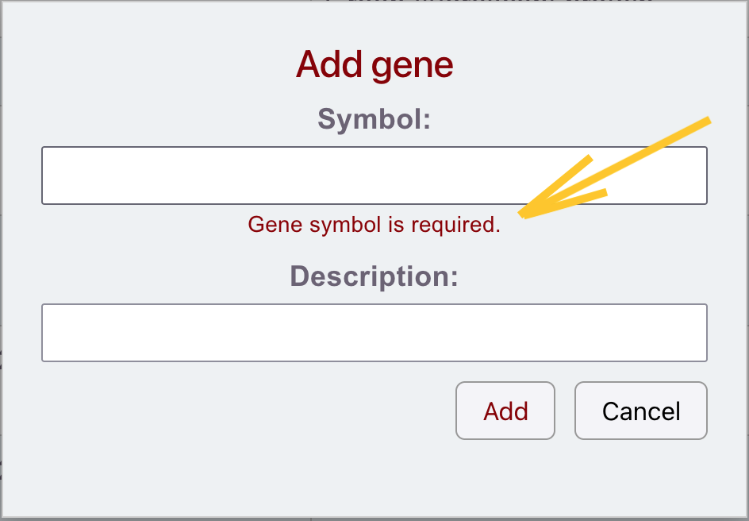

# Gene view error scenarios

This document describes expected error scenarios for the Gene view in AnimalDB.

The goal is to keep error handling clear and predictable for the user interface.

## ERR-GENE-001: Backend server is not available

**Status**
Partially implemented.

**When**  
User opens the Gene view or performs one of the following operations:

- list genes,
- refresh gene list,
- create gene,
- update gene,
- delete gene.

**Cause**  
The Spring Boot backend application is not running or cannot be reached by the frontend.

**Expected result**  
Application shows:


<div style="text-align: center; padding: 12px 2px; color: darkred; background-color: yellow; border-radius: 6px; font-weight: bold;">
<span style="font-size: 90%;">
Could not load genes.<span style="color: grey;"> | </span>
Could not create a new gene.<span style="color: grey;"> | </span>
Could not update the gene.<span style="color: grey;"> | </span>
Could not delete the gene.
</span></br>
Cannot connect to backend server. Please start the Spring Boot application.
</div>

**Notes**  
The first line is a frontend error context. The second line comes from the backend error response.

**UI behavior**

- The current view remains visible if possible.
- Any opened popup should be closed automatically.
- No data should be silently overwritten.

---

## ERR-GENE-002: Gene already exists

**When**  
User tries to create a gene with a symbol that already exists in the database.

**Example**  
A gene with symbol `GFP` already exists and user tries to create another gene with symbol `GFP`.

**Backend response**

```http
409 Conflict
```

```json
{
  "message": "Gene with symbol \"GFP\" already exists."
}
```

**Expected result**  
Application shows:

<div style="text-align: center; padding: 12px 2px; color: darkred; background-color: yellow; border-radius: 6px; font-weight: bold;">
Could not create a new gene.</br>
Gene with symbol "GFP" already exists.
</div>

**Notes**  
The first line is a generic frontend error context. The second line comes from the backend error response.

**UI behavior**

- The gene is not created.
- The Add gene popup remains open.
- User can correct the symbol and try again.

---

## ERR-GENE-003: Gene selected for editing no longer exists

**Status**  
This scenario is **not implemented** yet. The current frontend opens the edit popup based on the data already loaded in the table.

**When**  
User clicks a gene row in the table, but the selected gene was already deleted from the database.

**Example**  
The table still displays gene `GFP`, but another user or external tool deleted that record before the row was clicked.

**Backend response**

```http
404 Not Found
```

**Expected result**  
Application shows:

<div style="text-align: center; padding: 12px 2px; color: darkred; background-color: yellow; border-radius: 6px; font-weight: bold;">
Could not save edited gene.</br>
Server returned the error 404.
</div>

**UI behavior**

- The opened edit popup is closed.
- The gene list is refreshed.
- The deleted record disappears from the table.

---

## ERR-GENE-004: Gene selected for deletion no longer exists

**Status**
Partially implemented.

**When**  
User tries to delete a gene, but the record was already deleted from the database.

**Example**  
User opened the Edit gene popup, but before clicking Delete, the record was removed by another user or external tool.

**Backend response**

```http
404 Not Found
```

**Expected result**  
Application shows:

<div style="text-align: center; padding: 12px 2px; color: darkred; background-color: yellow; border-radius: 6px; font-weight: bold;">
 Could not delete the gene.</br>
Server returned the error 404.
</div>

**UI behavior**

- The opened popup is closed.
- The gene list is refreshed.
- The deleted record disappears from the table.

---

## ERR-GENE-005: Gene selected for update no longer exists

**Status**  
This scenario is **not implemented** yet.

**When**  
User opens the Edit gene popup, but before saving changes, the gene is deleted from the database.

**Example**  
User edits gene `GFP`, but another user or external tool deletes that record before Save is clicked.

**Backend response**

```http
404 Not Found
```

**Expected result**  
Application shows:

```text
Could not update gene. 
Server returned the error 404.
```

**UI behavior**

- The update is not saved.
- The gene list is refreshed.
- The popup may be closed because the edited record no longer exists.

---

## ERR-GENE-006: Gene update creates duplicate symbol

**Status**  
This scenario is **not implemented** yet.

**When**  
User edits an existing gene and changes its symbol to a symbol already used by another gene.

**Example**  
Genes `GFP` and `OT1` already exist. User edits `OT1` and changes its symbol to `GFP`.

**Backend response**

```http
409 Conflict
```

```json
{
  "message": "Gene with symbol \"GFP\" already exists."
}
```

**Expected result**  
Application shows:

```text
Gene with symbol "GFP" already exists.
```

**UI behavior**

- The gene is not updated.
- The Edit gene popup remains open.
- User can correct the symbol and try again.

---

## ERR-GENE-007: Gene symbol is empty

**When**  
User tries to create or update a gene without providing a symbol.

**Frontend validation**  
The Symbol field is required.

**Expected result**  
Following warning below the Symbol field is presented:  


```text
Gene symbol is required.
```

**UI behavior**

- No request is sent to the backend.
- The popup remains open, the above validation message is presented.
- User can enter a valid symbol and try again.

---

## ERR-GENE-008: Gene symbol is too long

**When**  
User tries to create or update a gene with a symbol longer than 50 characters.

**Validation rule**  
Gene symbol must have max 50 characters.

**Expected result**  
Application prevents or rejects the invalid value.

**UI behavior**  
The frontend input field prevents entering more than 50 characters.  
Following warning below the Symbol field is presented:

```text
Maximum length (50) reached.
```

---

## Notes

The frontend should prefer specific backend messages when they are available.

For example, if the backend returns:

```json
{
  "message": "Gene with symbol \"GFP\" already exists."
}
```

then the frontend should display:

```text
Gene with symbol "GFP" already exists.
```

If the backend response does not contain a non-empty `message`, the frontend should use a generic fallback message, for example:

```text
Server returned the error 404
```
Cannot connect to backend server. Please start the Spring Boot application.